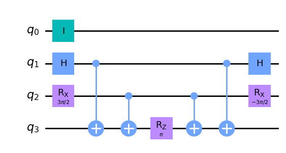
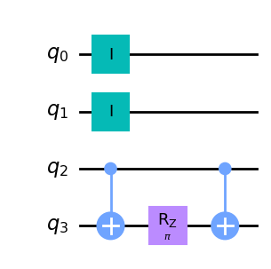

Getting Started
===============

This page details how to get started with adiabatic_fermi_hubbard.

Installation
------------

This package is designed for Python 3.8-3.12, provided the following packages are installed in the environment:

* numpy
* qiskit 0.46.1
* qiskit-aer
* qiskit-nature
* qiskit-algorithms
* matplotlib (optional)

To install adiabatic_fermi_hubbard in an environment meeting the above dependency requirements, run the following
commands:

::

    git clone git@github.com:y-pleim/adiabatic_fermi_hubbard.git
    cd adiabatic_fermi_hubbard
    pip install -e .

Background
----------
Fermi-Hubbard Model
'''''''''''''''''''
This package simulates the ground state of the Fermi-Hubbard model, which describes the behavior of electrons (fermions)
on a lattice. The Hamiltonian is given by

.. math:: H = -t \sum_{<i,j>,\sigma}(a_{i\sigma}^\dagger a_{j\sigma} + h.c.) + U\sum_{i} n_{i\uparrow}n_{i\downarrow} + \mu \sum_{i,\sigma} n_{i\sigma}

where 

* :math:`\sigma \in \{ \uparrow, \downarrow \}` is the electron spin
* :math:`a_{i\sigma} (a_{i\sigma}^\dagger)` is the annihilation/creation operator corresponding to site :math:`i` and spin :math:`sigma`
* :math:`n_{i\sigma} = a_{i\sigma}^\dagger a_{i\sigma}` is the number operator corresponding to site :math:`i`
* :math:`<i, j>` denotes neighboring lattice sites
* :math:`t, ~U, ~\mu` are energy scales

The first term is the "hopping" term which describes how electrons move from site to site (e.g., for adjacent sites :math:`i, j`, an electron hopping from
:math:`i` to :math:`j` can be described by the product of an annihilation operator on site :math:`i` and creation operator on site :math:`j`). The strength of this
term is controlled by the parameter :math:`t`. The second term describes an interaction between two electrons on the same site, with strength :math:`U`. The third
term is a uniform chemical potential with strength :math:`\mu` which controls the number of electrons.

Depending on the relative strengths of :math:`t, U, \mu`, the above model captures superconducting, antiferromagnetic (and ferromagnetic), and insulating phases. 
It has been applied to explain phenomena in materials whose properties depend on correlations between electrons, including high-temperature cuprate superconductors.
The Fermi-Hubbard model has an analytical solution for 1D lattices; however, a more physically relevant case for materials is the 2D case, which cannot
be solved analytically. Simulation approaches including Quantum Monte Carlo and exact diagonalization have been effective in describing much of the phenomena; however,
these approaches have limitations. <<fix this>>

Adiabatic State Preparation
'''''''''''''''''''''''''''
A general approach to finding the ground state of a "difficult" Hamiltonian :math:`H_{final}` is to initialize a qubit system in the ground state of a known Hamiltonian 
:math:`H_{initial}` and evolve the system using evolution operator :math:`U(s) = exp(-iH(s)\delta t)` with Hamiltonian

.. math:: H(s) = H_{init} (1-s) + H_{final} (s) = H_{init} (1- k/M) + H_{final} (k/M)

where :math:`M` is the number of interpolating steps and :math:`k = 0, 1, ... M`. Provided the interpolation between :math:`H_{initial}` and :math:`H_{final}` is slow,
the adiabatic principle states the system remains in an energy eigenstate of :math:`H(s)` at all times. So, the state of the system following interpolation is
the ground state of :math:`H_{final}`. The adiabatic_fermi_hubbard package applies this approach to find the ground state of the Fermi-Hubbard model for small lattices.

Implementation
--------------
This package creates Qiskit circuits to carry out adiabatic state preparation to find the ground state energy of the Fermi-Hubbard Hamiltonian. The following
section highlights some details of the implementation.

Jordan-Wigner Transformation
''''''''''''''''''''''''''''
Qiskit creates circuits that run on spin qubits. To represent a Hamiltonian composed of fermionic creation/annihilation operators, the Jordan-Wigner Transformation
is applied. Under this transformation, the fermionic operators are given by

This transformation is carried out by using qiskit-nature's Jordan-Wigner qubit mapper.

Rotation about N-dimensional Pauli strings
''''''''''''''''''''''''''''''''''''''''''

Validation
''''''''''

Examples
--------

Initializing a HubbardHamiltonian object for a 4 site lattice
'''''''''''''''''''''''''''''''''''''''''''''''''''''''''''''
This example shows how to create instances of the Lattice and HubbardHamiltonian classes.

::

    import adiabatic_fermi_hubbard as afh 
    lattice1 = afh.Lattice(4, bc=0) # no periodic boundary conditions

    # create HubbardHamiltonian with t = 2, U = 4, mu = -2
    hamiltonian1 = afh.HubbardHamiltonian(lattice1, t=2, U=4, mu=-2)

    print(hamiltonian1)

This should produce the following output:

::

    t = 2
    U = 4
    mu = -2

    Lattice:
    Number of sites: 4 sites, 
    Periodic boundary conditions: False.

    Fermionic Operator
    number spin orbitals=8, number terms=24
    -2.0 * ( +_0 -_2 )
    + 2.0 * ( -_0 +_2 )
    + -2.0 * ( +_2 -_4 )
    + 2.0 * ( -_2 +_4 )
    + -2.0 * ( +_4 -_6 )
    + 2.0 * ( -_4 +_6 )
    + 2.0 * ( -_1 +_3 )
    + -2.0 * ( +_1 -_3 )
    + -2.0 * ( +_3 -_5 )
    + 2.0 * ( -_3 +_5 )
    + 2.0 * ( -_5 +_7 )
    + -2.0 * ( +_5 -_7 )
    + 4.0 * ( +_4 -_4 +_5 -_5 )
    + 4.0 * ( +_6 -_6 +_7 -_7 )
    + 4.0 * ( +_0 -_0 +_1 -_1 )
    ...
    + -2.0 * ( +_1 -_1 )
    + -2.0 * ( +_2 -_2 )
    + -2.0 * ( +_5 -_5 )
    + -2.0 * ( +_7 -_7 )

Rotating about a Pauli string
'''''''''''''''''''''''''''''
This example demonstrates the functionality of the AdiabaticCircuit method pauli_string_rotation.

::
    
    import adiabatic_fermi_hubbard as afh
    import numpy as np
    import matplotlib as mpl
    from qiskit.quantum_info import SparsePauliOp

    lattice1 = afh.Lattice(2, bc=0) # 2 sites = 4 qubits, no periodic boundary conditions

    # create HubbardHamiltonian with t = 2, U = 4, \mu = -2
    hamiltonian1 = afh.HubbardHamiltonian(lattice1, t=2, U=4, mu=-2)

    # create AdiabaticCircuit object
    ad_circ1 = afh.AdiabaticCircuit(hamiltonian1)

    operators = SparsePauliOp(["ZYXI", "ZZII"], coeffs=[1,1])
    # rotation about ZYXI (rightmost gate acts on qubit 0)

    circ1 = ad_circ1.pauli_string_rotation(operators.paulis[0], np.pi)

    # rotation about ZZII (rightmost gate acts on qubit 0)
    circ2 = ad_circ1.pauli_string_rotation(operators.paulis[1], np.pi)

    circ2.draw(output = "mpl")

This should produce the following two circuits:

Building and running an adiabatic state preparation circuit for N = 2 lattice sites
'''''''''''''''''''''''''''''''''''''''''''''''''''''''''''''''''''''''''''''''''''
This example shows how to create and execute a circuit to find the ground state energy of a Fermi-Hubbard Hamiltonian through
adiabatic state preparation.

::

    import adiabatic_fermi_hubbard as afh

    lattice1 = afh.Lattice(2, bc=0) # no periodic boundary conditions

    # create HubbardHamiltonian with t = 2, U = 10, \mu = -5
    hamiltonian1 = afh.HubbardHamiltonian(lattice1, t=2, U=10, mu=-5)

    # create AdiabaticCircuit with time_step = 0.01, step_count = 20000
    ad_circ1 = afh.AdiabaticCircuit(hamiltonian1, time_step = 0.01, step_count = 20000)

    circ = ad_circ1.create_circuit()
    result = ad_circ1.run(circ)
    energy = ad_circ.calc_energy(result)

    print("Ground state energy: " + str(energy))
    
This should result in the following output:

::

    Ground state energy: 

Using qiskit-nature's eigensolver
'''''''''''''''''''''''''''''''''
This example illustrates the methods in the AdiabaticCircuit class which can be used for validating
the ground state energy resulting from adiabatic state preparation.

::

    import adiabatic_fermi_hubbard as afh

    lattice1 = afh.Lattice(2, bc=0) # no periodic boundary conditions

    # create HubbardHamiltonian with t = 2, U = 10, \mu = -5
    hamiltonian1 = afh.HubbardHamiltonian(lattice1, t=2, U=10, mu=-5)

    # create AdiabaticCircuit with time_step = 0.01, step_count = 20000
    ad_circ1 = afh.AdiabaticCircuit(hamiltonian1, time_step = 0.01, step_count = 20000)

    comparison_energy = ad_circ1.run_eigensolver_comparison()

    print("Ground state energy from eigensolver: " + str(comparison_energy))

This result in the following output:

::

    Ground state energy from eigensolver: 

References
----------