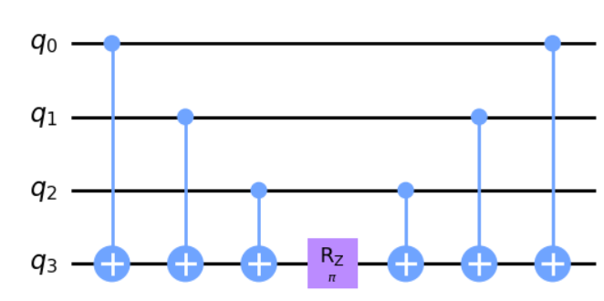
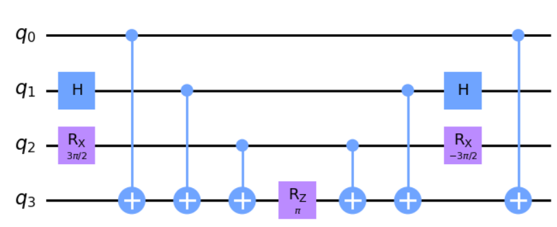
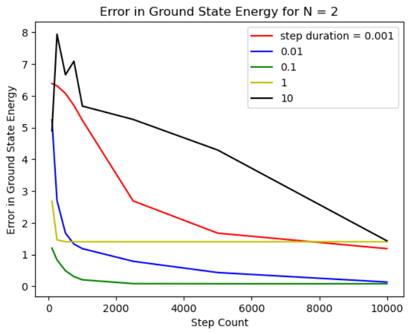

Getting Started
===============

This page details how to get started with adiabatic_fermi_hubbard.

Installation
------------

This package is designed for Python 3.8-3.12, provided the following packages are installed in the environment:

* numpy
* qiskit 0.46.1
* qiskit-aer
* qiskit-nature
* qiskit-algorithms
* matplotlib (optional)

To install adiabatic_fermi_hubbard in an environment with the above dependencies installed, run the following
commands:

::

    git clone git@github.com:y-pleim/adiabatic_fermi_hubbard.git
    cd adiabatic_fermi_hubbard
    pip install -e .

Background
----------
Fermi-Hubbard Model
'''''''''''''''''''
This package simulates the ground state of the Fermi-Hubbard model, which describes the behavior of electrons (fermions)
on a lattice. The Hamiltonian is given by:

.. math:: H = -t \sum_{<i,j>,\sigma}(a_{i\sigma}^\dagger a_{j\sigma} + h.c.) + U\sum_{i} n_{i\uparrow}n_{i\downarrow}
    :label: ham

where 

* :math:`\sigma \in \{ \uparrow, \downarrow \}` is the electron spin
* :math:`a_{i\sigma} (a_{i\sigma}^\dagger)` is the annihilation/creation operator corresponding to site :math:`i` and spin :math:`sigma`
* :math:`n_{i\sigma} = a_{i\sigma}^\dagger a_{i\sigma}` is the number operator corresponding to site :math:`i`
* :math:`<i, j>` denotes neighboring lattice sites
* :math:`t, ~U` are energy scales

The first term is the "hopping" term which describes how electrons move from site to site (e.g., for adjacent sites :math:`i, j`, an electron hopping from
:math:`i` to :math:`j` can be described by the product of an annihilation operator on site :math:`i` and creation operator on site :math:`j`). The strength of this
term is controlled by the parameter :math:`t`. The second term describes an interaction between two electrons on the same site, with strength :math:`U`. 
Depending on the relative strengths of :math:`t, U`, the above model captures superconducting, antiferromagnetic (and ferromagnetic), and insulating phases. 
It has been applied to explain phenomena in materials whose properties depend on correlations between electrons, including high-temperature cuprate superconductors **[1]**.

The above Hamiltonian can be modified to include a chemical potential term with strength :math:`\mu` to control the number of electrons in the lattice **[2]**:

.. math:: H = -t \sum_{<i,j>,\sigma}(a_{i\sigma}^\dagger a_{j\sigma} + h.c.) + U\sum_{i} n_{i\uparrow}n_{i\downarrow} + \mu \sum_{i,\sigma} n_{i\sigma}
    :label: ham_with_mu

Quantum Computing and the Fermi-Hubbard Model
'''''''''''''''''''''''''''''''''''''''''''''
The Fermi-Hubbard model has an analytical solution for 1D lattices; however, a more physically relevant case for materials is the 2D case, which cannot
be solved analytically and must be simulated. Classical simulation approaches have been effective in describing much of the phenomena; however, these techniques 
have limitations **[3]**. Quantum Monte Carlo (QMC) simulations are successful in describing many-electron lattices, provided the Boltzmann factors involved do not
become negative, which can happen in fermionic systems. For :math:`U > 0`, QMC simulations do not converge unless the lattice is "half-filled" due to this sign problem
**[4]**. "Half-filling" refers to the situation in which the number of lattice sites equals the number of electrons **[5]**. Exact diagonalization techniques, which utilize
symmetries to reduce the problem to a smaller Hilbert space, are effective for small lattice sizes **[6]**, **[7]**, **[8]**.

Due to the limitations of classical simulations, there has been significant interest for using quantum computers to simulate the Fermi-Hubbard model. These efforts
range from quantum emulation, in which evolution under the Hamiltonian is implemented on a representative qubit system (e.g., atomic lattices) **[3]**, to quantum algorithms
on spin qubits (e.g., variational quantum eigensolvers on superconducting qubits) **[9]**. Another approach to quantum simulation is adiabatic state preparation.

Adiabatic State Preparation
'''''''''''''''''''''''''''
A general approach to finding the ground state of a "difficult" Hamiltonian :math:`H_{final}` is to initialize a qubit system in the ground state of a known Hamiltonian 
:math:`H_{initial}` and evolve the system using evolution operator :math:`U(s) = exp(-iH(s)\Delta t)` with Hamiltonian

.. math:: H(s) = (1-s) H_{init} + (s) H_{final} = H_{init} (1- k/M) + H_{final} (k/M)
    :label: adiabatic

where :math:`M` is the number of interpolating steps and :math:`k = 0, 1, ... M` **[10]**, **[11]**. Provided the interpolation between :math:`H_{initial}` and :math:`H_{final}` is slow,
the adiabatic principle states the system remains in an energy eigenstate of :math:`H(s)` at all times. So, the state of the system following interpolation is
the ground state of :math:`H_{final}`. The total evolution time :math:`t = M\Delta t` must satisfy :math:`t >> 1/(E_0-E_1)^2` where :math:`E_0-E_1` is
the smallest difference between the first excited state and the ground state of :math:`H` for any :math:`s` **[10]**.

This approach has been previously applied to simulate the ground state of Fermi-Hubbard model with chemical potential and magnetic
field terms, starting from the ground state of a Hamiltonian that describes d-wave electron pairing (a type of superconductivity) **[2]**. 
The adiabatic_fermi_hubbard package uses a different starting point to find the ground state of the Fermi-Hubbard model through adiabatic state preparation
for small lattices.

Implementation
--------------
This package creates Qiskit circuits **[12]** to carry out adiabatic state preparation to find the ground state energy of the Fermi-Hubbard Hamiltonian on
1D lattices. The following section highlights some details of the implementation.

Representing Fermionic Operators
''''''''''''''''''''''''''''''''
This package relies heavily on methods in qiskit-nature, a part of the Qiskit ecosystem **[13]**, to create and manipulate fermionic raising/lowering operators. This
is accomplished through the use of qiskit-nature's FermionicOp objects **[14]**. The adiabatic_fermi_hubbard package adopts qiskit-nature's convention for representing 
creation/annihilation operators for up and down spins, where FermionicOps with even (odd) indices correspond to spin up (down) electrons. For example, the
four creation/annilhilation operators for the first site in a 8-site 1D lattice are

* :math:`a_{0 \uparrow}`: ``FermionicOp({“-_0”:1.0}, num_spin_orbitals=16)``
* :math:`a^\dagger_{0 \uparrow}`: ``FermionicOp({“+_0”:1.0}, num_spin_orbitals=16)``
* :math:`a_{0 \downarrow}`: ``FermionicOp({“-_1”:1.0}, num_spin_orbitals=16)``
* :math:`a^\dagger_{0 \downarrow}`: ``FermionicOp({“+_1”:1.0}, num_spin_orbitals=16)``

The above example shows that the fermionic operators for a single lattice site are represented by two qubits (in this case, 0 and 1). For an :math:`N = 8` lattice, the
total number of qubits is :math:`2N = 16` (hence the value of ``num_spin_orbitals`` in the above constructors) **[15]**.

For a specified lattice size and :math:`t, U, \mu` parameters, the adiabatic_fermi_hubbard constructs the Fermi-Hubbard Hamiltonian :eq:`ham_with_mu` out of these FermionicOp objects.

Jordan-Wigner Transformation
''''''''''''''''''''''''''''
One mapping which takes the fermionic operators in the Fermi-Hubbard Hamiltonian to operations which can be run on a spin-based qubit system is the
Jordan-Wigner transformation. The transformation is given by

.. math:: a_{i} = \bigotimes_{j=1}^{i} Z_j \otimes (X_i - i Y_i), a_{i}^\dagger = \bigotimes_{j=1}^{i} Z_j \otimes (X_i + i Y_i), 

where :math:`X_k, Y_k, Z_k` are Pauli gates acting on qubit :math:`k` and :math:`i` are the indices assigned by the convention in the previous section **[16]**.
The adiabatic_fermi_hubbard package applies this transformation to express the Hamiltonian as a weighted sum of Pauli strings (e.g., :math:`X \otimes Y \otimes Z \otimes I`).
of size :math:`2N`, where :math:`N` is the number of lattice sites.

Trotterization
''''''''''''''
Following the Jordan-Wigner transformation, the Fermi-Hubbard Hamiltonian becomes a sum of Pauli strings, each of which has an associated
coefficient. Symbolically,

.. math:: H_{after ~JW} = \sum_{j}^{K} \alpha_j P_j
    :label: jw_ham

where :math:`\alpha_i` are the coefficients and :math:`P_i` are Pauli strings of length :math:`2N`.
Generally, not all of the Pauli strings in :math:`H_{after JW}` commute, meaning

.. math:: exp(-i \Delta t \sum_{j} \alpha_j P_j ) \neq exp(-i \Delta t \alpha_1 P_1) exp(-i \Delta t \alpha_2 P_2) ... exp(-i \Delta t \alpha_K P_K)

However, provided :math:`\Delta t` is small, the Trotter approximation allows

.. math:: exp(-i \Delta t \sum_{j} \alpha_j P_j ) \approx exp(-i \Delta t \alpha_1 P_1) exp(-i \Delta t \alpha_2 P_2) ... exp(-i \Delta t \alpha_K P_K)

**[11]**, **[17]**. The adiabatic_fermi_hubbard package assumes the Trotter approximation to decompose the Jordan-Wigner transformed Hamiltonian into a sequence
of rotations about Pauli strings.

Rotation about :math:`2N` -dimensional Pauli strings
''''''''''''''''''''''''''''''''''''''''''''''''''''
Once an evolution operator of the form :math:`exp(-i \Delta t  \sum_{j}^{K} \alpha_j P_j)` is decomposed using the 
Trotter approximation, it becomes necessary to implement rotations about arbitrary Pauli strings of length :math:`2N`. 
To accomplish this, the package utilizes the approach discussed in Nielsen and Chuang, Ch 4 **[17]**. The strategy is briefly summarized here.

A rotation about an arbitrary Pauli string can be turned into a single qubit rotation by mapping the parity of each qubit onto an
ancilla qubit (or onto the last qubit involved in the rotation) using :math:`CNOT` gates and then performing a :math:`Z`-rotation on that qubit. Following said 
rotation, :math:`CNOT` s are required to "uncompute" the parity. For instance, a circuit which performs the rotation :math:`exp(-i \pi (ZZZZ))` is given by

If the Pauli string contains :math:`X` or :math:`Y` gates, they can be transformed into :math:`Z` gates for the purpose of the parity encoding by applying a 
:math:`H` gate or a :math:`R_Y(3\pi/2)` gate before the :math:`CNOT` s, respectively. The inverse operations are required after the second set of :math:`CNOT` s. For example,
a circuit which performs the rotation :math:`exp(-i \ pi (ZXYZ))` is

Additional details can be found in **[17]**.

Adiabatic Evolution
'''''''''''''''''''
With the evolution operator corresponding to the Fermi-Hubbard Hamiltonian written in terms of single- and two-qubit gates, the adiabatic evolution can
be implemented according to Equation :eq:`adiabatic` provided :math:`H_{init}` is specified and the system is initialized in the ground state of :math:`H_{init}`.
The adiabatic_fermi_hubbard package uses

.. math:: H_{init} = \sum_{i}^{2N} X_i, ~ |\psi_0 \rangle = |--...- \rangle

as its starting Hamiltonian, with the ground state :math:`|\psi_0 \rangle`, as in **[11]**. For each :math:`k = 0, 1, ..., M`, the package builds the evolution operator

.. math:: U(k) \approx exp(-i \Delta t H_{init}) exp(-i \Delta t H_{final})

and constructs the circuit which carries out the operation

.. math:: |\psi_0, ~FH \rangle = U(M)U(M-1)...U(2)U(1)U(0) |\psi_0 \rangle

from which the ground state energy is calculated:

.. math:: E_{gs} = \langle \psi_0 | H_{after~JW} | \psi_0 \rangle

Validation
''''''''''
To verify the ground state energy which results from the adiabatic state preparation circuit, adiabatic_fermi_hubbard includes methods which
utilize qiskit-nature's lattice problem eigensolver **[15]**. This approach works for lattices up to :math:`N = 11` sites. 

Examples
--------

Initializing a HubbardHamiltonian object for a 4 site lattice
'''''''''''''''''''''''''''''''''''''''''''''''''''''''''''''
This example shows how to create instances of the Lattice and HubbardHamiltonian classes.

::

    import adiabatic_fermi_hubbard as afh 
    lattice1 = afh.Lattice(4, bc=0) # no periodic boundary conditions

    # create HubbardHamiltonian with t = 2, U = 4, mu = -2
    hamiltonian1 = afh.HubbardHamiltonian(lattice1, t=2, U=4, mu=-2)

    print(hamiltonian1)

This should produce the following output:

::

    t = 2
    U = 4
    mu = -2

    Lattice:
    Number of sites: 4 sites, 
    Periodic boundary conditions: False.

    Fermionic Operator
    number spin orbitals=8, number terms=24
    -2.0 * ( +_0 -_2 )
    + 2.0 * ( -_0 +_2 )
    + -2.0 * ( +_2 -_4 )
    + 2.0 * ( -_2 +_4 )
    + -2.0 * ( +_4 -_6 )
    + 2.0 * ( -_4 +_6 )
    + 2.0 * ( -_1 +_3 )
    + -2.0 * ( +_1 -_3 )
    + -2.0 * ( +_3 -_5 )
    + 2.0 * ( -_3 +_5 )
    + 2.0 * ( -_5 +_7 )
    + -2.0 * ( +_5 -_7 )
    + 4.0 * ( +_4 -_4 +_5 -_5 )
    + 4.0 * ( +_6 -_6 +_7 -_7 )
    + 4.0 * ( +_0 -_0 +_1 -_1 )
    ...
    + -2.0 * ( +_1 -_1 )
    + -2.0 * ( +_2 -_2 )
    + -2.0 * ( +_5 -_5 )
    + -2.0 * ( +_7 -_7 )

Rotating about a Pauli string
'''''''''''''''''''''''''''''
This example demonstrates the functionality of the AdiabaticCircuit method pauli_string_rotation.

::
    
    import adiabatic_fermi_hubbard as afh
    import numpy as np
    import matplotlib as mpl
    from qiskit.quantum_info import SparsePauliOp

    lattice1 = afh.Lattice(2, bc=0) # 2 sites = 4 qubits, no periodic boundary conditions

    # create HubbardHamiltonian with t = 2, U = 4, \mu = -2
    hamiltonian1 = afh.HubbardHamiltonian(lattice1, t=2, U=4, mu=-2)

    # create AdiabaticCircuit object
    ad_circ1 = afh.AdiabaticCircuit(hamiltonian1)

    operators = SparsePauliOp(["ZYXI", "ZZII"], coeffs=[1,1])
    # rotation about ZYXI (rightmost gate acts on qubit 0)

    circ1 = ad_circ1.pauli_string_rotation(operators.paulis[0], np.pi)

    # rotation about ZZII (rightmost gate acts on qubit 0)
    circ2 = ad_circ1.pauli_string_rotation(operators.paulis[1], np.pi)

    circ2.draw(output = "mpl")

This should produce the following two circuits:

.. image:: ./zyxi.png
 :width: 400

.. image:: ./zzii.png
 :width: 400

Building and running an adiabatic state preparation circuit for N = 2 lattice sites
'''''''''''''''''''''''''''''''''''''''''''''''''''''''''''''''''''''''''''''''''''
This example shows how to create and execute a circuit to find the ground state energy of a Fermi-Hubbard Hamiltonian through
adiabatic state preparation.

::

    import adiabatic_fermi_hubbard as afh

    lattice1 = afh.Lattice(2, bc=0) # no periodic boundary conditions

    # create HubbardHamiltonian with t = 2, U = 10, \mu = -5
    hamiltonian1 = afh.HubbardHamiltonian(lattice1, t=2, U=10, mu=-5)

    # create AdiabaticCircuit with time_step = 0.01, step_count = 20000
    ad_circ1 = afh.AdiabaticCircuit(hamiltonian1, time_step = 0.01, step_count = 20000)

    circ = ad_circ1.create_circuit()
    result = ad_circ1.run(circ)
    energy = ad_circ1.calc_energy(result)

    print("Ground state energy: " + str(energy))
    
This should result in the following output (after approximately 5 minutes): 

::

    Ground state energy: -11.389327679835297

Using qiskit-nature's eigensolver
'''''''''''''''''''''''''''''''''
This example illustrates the methods in the AdiabaticCircuit class which can be used for validating
the ground state energy resulting from adiabatic state preparation.

::

    import adiabatic_fermi_hubbard as afh

    lattice1 = afh.Lattice(2, bc=0) # no periodic boundary conditions

    # create HubbardHamiltonian with t = 2, U = 10, \mu = -5
    hamiltonian1 = afh.HubbardHamiltonian(lattice1, t=2, U=10, mu=-5)

    # create AdiabaticCircuit with time_step = 0.01, step_count = 20000
    ad_circ1 = afh.AdiabaticCircuit(hamiltonian1, time_step = 0.01, step_count = 20000)

    comparison_energy = ad_circ1.run_eigensolver_comparison()

    print("Ground state energy (eigensolver): " + str(comparison_energy))

This result in the following output:

::

    Ground state energy (eigensolver): -11.403124237432863

Error as a function of step count / step length
'''''''''''''''''''''''''''''''''''''''''''''''
The following code block creates a plot which shows the difference between the ground state energy found through adiabatic state preparation and
the reference ground state energy found using qiskit-nature for different step counts and sizes.

::

    import adiabatic_fermi_hubbard as afh
    import numpy as np
    import matplotlib.pyplot as plt

    counts_list = [100, 250, 500, 750, 1000, 2500, 5000, 7500] # step counts
    steps_list = [0.001, 0.01, 0.1, 1, 10] # time steps

    lattice1 = afh.Lattice(2, bc=0) # 2 sites = 4 qubits, no periodic boundary conditions

    # create HubbardHamiltonian with t = 2, U = 10, \mu = -5
    hamiltonian1 = afh.HubbardHamiltonian(lattice1)
    ad_circ1 = afh.AdiabaticCircuit(hamiltonian1)
    energy_diffs = []
    
    # get qiskit-nature reference energy for lattice
    ref_energy = ad_circ1.run_eigensolver_comparison()

    for i in range(len(steps_list)): # for each step duration
        row = []
        for j in range(len(counts_list)):
            # assign time step, step count
            ad_circ1 = afh.AdiabaticCircuit(hamiltonian1, time_step = steps_list[i], step_count = counts_list[j])
            circuit = ad_circ1.create_circuit()
            result = ad_circ1.run(circuit)
            energy = ad_circ1.calc_energy(result)
            row.append(energy-ref_energy)
    energy_diffs.append(row)

    plt.plot(counts_list, energy_diffs[0], "-r",
            counts_list, energy_diffs[1], "-b",
            counts_list, energy_diffs[2], "-g",
            counts_list, energy_diffs[3], "-y",
             counts_list, energy_diffs[4], "-k")

    plt.legend(["step duration = 0.001", "0.01", "0.1", "1", "10"], loc='best')
    plt.xlabel("Step Count")
    plt.ylabel("Error in Ground State Energy")
    plt.title("Error in Ground State Energy for N = 2")

This will produce the following after an evaluation time of approximately 25 minutes:

There are a few trends to pick out from the above plot:

* First, as the step count :math:`M` increases, the error or difference between the adiabatic solution and the qiskit-nature reference generally improves. This can be understood from the fact that as the total evolution time :math:`t = M \Delta t` increases, :math:`t` becomes larger relative to :math:`1/(E_0-E_1)^2`.
* For short time steps, the total evolution time becomes small, in which case the condition :math:`t >> 1/(E_0-E_1)^2` may no longer be fulfilled.
* For long time steps (e.g., 1 and 10) the evolution time is longer; however, the Trotter approximation becomes worse since :math:`\Delta t` is no longer considered a small argument.

<To add: spectral gap analysis>

References
----------
**[1]** Qin, M., T. Schäfer, S. Andergassen, P. Corboz, and E. Gull, 2022, Annu. Rev. Condens. Matter Phys., 13, 275-302, DOI: https://doi.org/10.1146/annurev-conmatphys-090921-033948.

**[2]** Jiang, Z., K. J. Sung, K. Kechedzhi, V. N. Smelyanskiy, and S. Boixo, 2018, Phys. Rev. Applied, 9, 044036, DOI: https://doi.org/10.1103/PhysRevApplied.9.044036. 

**[3]** Hofstetter, W. and T. Qin, 2018, J. Phys. B: At. Mol. Opt. Phys., 51, 082001, DOI: https://doi.org/10.1088/1361-6455/aaa31b.

**[4]** Li, Z-X. and H. Yao, 2019, Annu. Rev. Condens. Matter Phys., 10, 337-56, DOI: https://doi.org/10.1146/annurev-conmatphys-033117-054307.

**[5]** Arovas, D. P., E. Berg, S. A. Kivelson, and S. Raghu, Annu. Rev. Condens. Matter Phys., 13, 239-74, DOI: https://doi.org/10.1146/annurev-conmatphys-031620-102024. 

**[6]** Zhang, J. M., and R. X. Dong, 2010, Eur. J. Phys., 31, 591, DOI: https://doi.org/10.1088/0143-0807/31/3/016.

**[7]** Lin, H. Q., 1990, 42, 6561, DOI: https://doi.org/10.1103/PhysRevB.42.6561.  

**[8]** Lin, H. Q., J. E. Gubernatis, H. Gould, and J. Tobochnik, 1993, Comput. Phys. 7, 400-07, DOI: https://doi.org/10.1063/1.4823192.

**[9]** Stanisic, S., J. L. Bosse, F. M. Gambetta, R. A. Santos, W. Mruczkiewicz, T. E. O’Brien, E. Ostby, and A. Montanaro, 2022, Nat. Commun., 13, 5743, DOI: https://doi.org/10.1038/s41467-022-33335-4.

**[10]** Albash, T. and D. A. Lidar, 2018, Rev. Mod. Phys., 90, 015002, DOI: https://doi.org/10.1103/RevModPhys.90.015002.

**[11]** Mayhall, N. Adiabatic Evolution of Ising Hamiltonian with Quantum Circuit. https://github.com/CHEM-PHYS-X684/AdiabaticPrinciple/blob/main/3_adiabatic.ipynb. 

**[12]** Qiskit contributors. Qiskit: An Open-source Framework for Quantum Computing, 2023, DOI: https://doi.org/10.5281/zenodo.2573505. 

**[13]** Qiskit Nature Development Team. Qiskit Nature. DOI: https://doi.org/10.5281/zenodo.7828767.

**[14]** Qiskit Nature Development Team. FermionicOp.  https://qiskit-community.github.io/qiskit-nature/stubs/qiskit_nature.second_q.operators.FermionicOp.html#qiskit_nature.second_q.operators.FermionicOp 

**[15]** Qiskit Nature Development Team. Lattice models. https://qiskit-community.github.io/qiskit-nature/tutorials/10_lattice_models.html. 

**[16]** Qiskit Nature Development Team. Mapping to the Qubit Space. https://qiskit-community.github.io/qiskit-nature/tutorials/06_qubit_mappers.html. 

**[17]** Nielsen, M., A., and I. L. Chuang. “4: Quantum Circuits”, Quantum Computation and Quantum Information, Cambridge University Press, 2010. 
